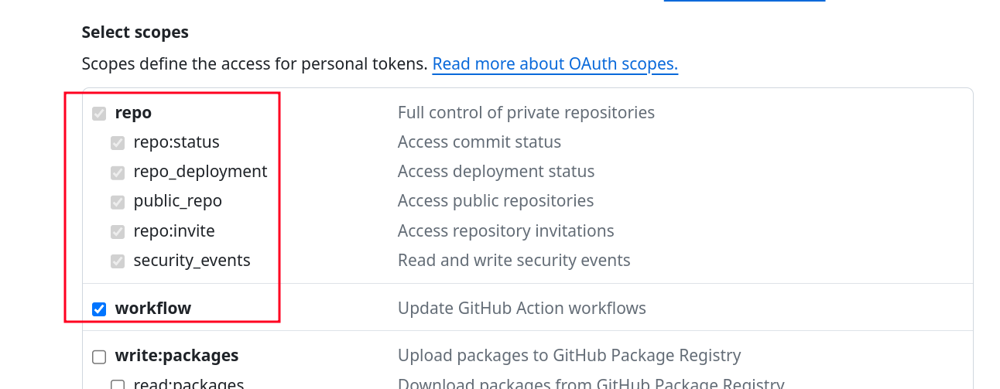

# Шаблонный репозитарий для разработки модулей для клиента

## Использование

### Перед первым использованием

1. [Создайте personal access token в github](https://docs.github.com/en/authentication/keeping-your-account-and-data-secure/managing-your-personal-access-tokens#creating-a-personal-access-token-classic)
2. В настройках токена укажите доступ к репозитариям и workflow
   
3. Можно создать отдельный токен специально для создания репозитариев или других работ,
   которые связаны именно с изменением репозитария

<!-- prettier-ignore-start -->
> [WARNING]
>
> При создании токена обязательно учитывайте рекомендации по безопасности от GitHub.
> Как минимум
>
> - установите срок действия токена и периодически его обновляйте
> - не давайте токену больше прав, чем необходимо
> - не храните токен в открытом виде
> - не передавайте токен третьим лицам
<!-- prettier-ignore-end -->

4. Не забудьте его сохранить в безопасном месте, так как после создания доступ к нему
   будет только один раз
5. Если у вас аккаунт организации в github, то создайте в настройках организации secret
   с именем `CICD_TOKEN`
6. Если пользуетесь персональным аккаунтом, то этот секрет придется создавать для
   каждого нового репозитария

### Создание нового репозитария

1. Создайте новый репозитарий на основе этого шаблона

2. После создания репозитария в разделе `Actions` запустите workflow `Setup repository`

3. При правильной настройке секрета `CICD_TOKEN` у вас будут созданы все неоходимые для
   работы переменные и секреты
